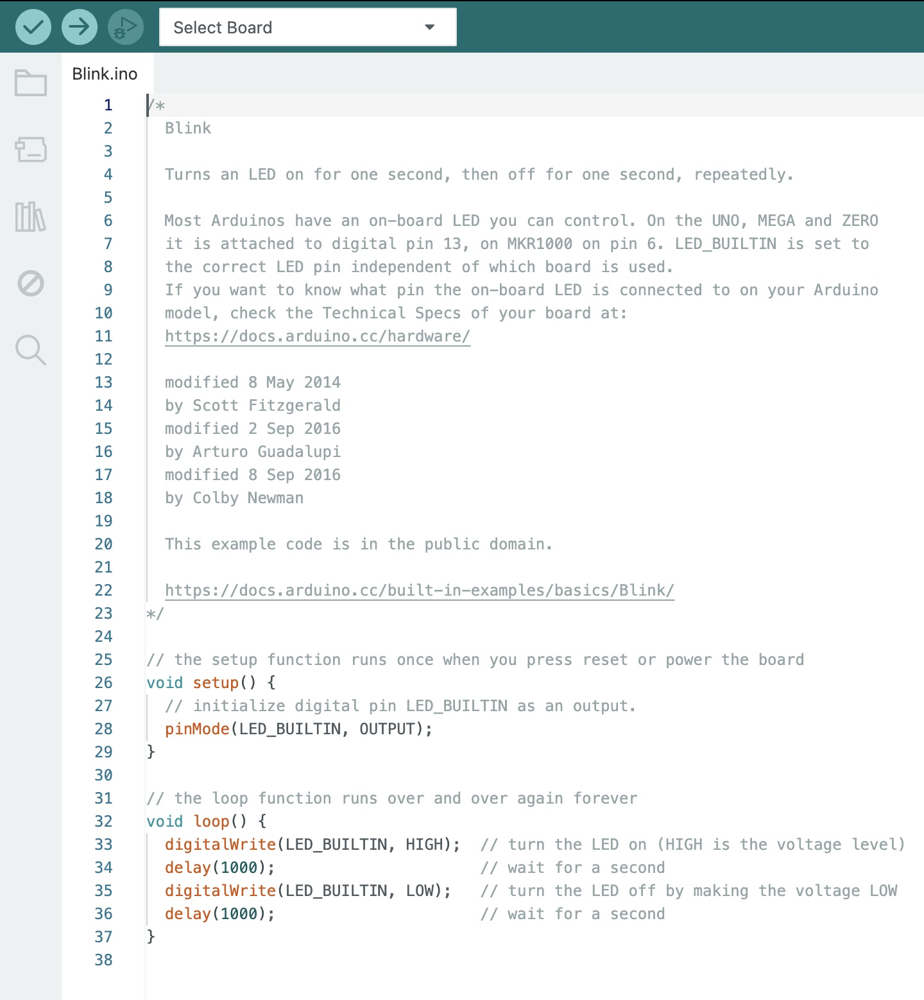

# nodemcu-01
## 📌 Översikt
Den här guiden visar hur du som student kör ditt första **Blink-program** med **NodeMCU (ESP8266)** i Arduino IDE.

🧠 **Du kommer att lära dig:**
- Vad en mikrokontroller är
- Basfuktionerna `setup()` och `loop()` i **Arduino IDE**
- Hur du laddar upp ett program till din NodeMCU
- Hur du får en LED (på din NodeMCU) att blinka

⚠️ **Denna guide förutsätter att:**
- Arduino IDE redan är installerat
- ESP8266-tillägget redan är tillagt
- NodeMCU är korrekt inkopplad med USB-kabel

## 🔧 Mikrokontroller (som används)
Du kommer att använda dig av **NodeMCU med ESP8266-processorn**, som är en liten och billig mikrokontroller med:
- Inbyggt WiFi
- Flera digitala I/O-portar
- Enkel programmering via USB
- Stöd i Arduino IDE

Den fungerar som en mini-dator som kör instruktioner i en loop, och används ofta i IoT-projekt.

## ⚙️ Två basfunktioner i Arduino: `setup()` och `loop()`
Alla Arduino-program består av två huvuddelar: `setup()` och `loop()`. Man kan säga att dessa gör basen i varje sketch.

### 🟦 `setup()` – körs en gång
`setup()` körs endast en gång när programmet startar, t.ex. efter uppladdning eller när du trycker på reset.

Här gör man alla initialiseringar, t.ex:

- Ställa in vilka portar som är `INPUT` eller `OUTPUT`  
- Starta seriell kommunikation  
- Initiera sensorer och bibliotek  

**Exempel:**
```cpp
void setup() {
  // lägg din installationskod här, för att köra en gång:

}
```

Tänk på `setup()` som "startinställningar" innan programmet börjar rulla.

### 🟩 loop() – körs om och om igen

`loop()` är huvudprogrammet. Efter att `setup()` körts startar `loop()` — och körs i en oändlig slinga så länge enheten är på.

Här lägger man allt som ska hända upprepade gånger:
- Tända/släcka LED
- Läsa sensorer
- Reagera på knapptryck
- Skicka data
- Köra logik, timers osv.

**Exempel:**
```c++
void loop() {
  // skriv in din huvudkod här, för att köra den upprepade gånger:
}
```


## 💡 Blink-programmet

För att komma igång med Blink-programmet följ de här stegen:

1. **Öppna upp** Arduino IDE och se till att allt är rätt inkopplat

   Du kommer mötas med detta: *bild*
2. **Gå till** `File` -> `Examples` -> `01.Basics` -> `Blink`

   Nu borde ett **nytt fönster** med en **ny sketch** (Blink.ino) öppnas och se ut så här:

    
4. Allt är nu egentligen färdigskrivet och **redo att köras** 😌
5. Det du kan göra nu är att ändra `delay()` om du vill att LED ska blinka snabbare eller långsammare.

   ⬇️ I det här **exemplet** är den 2 sekunder tänd och 2 sekund släckt, alltså blinkar långsammare ⬇️


```c++
void setup() {
  pinMode(LED_BUILTIN, OUTPUT); // Sätter den inbyggda LED:en som output
}

void loop() {
  digitalWrite(LED_BUILTIN, HIGH); // Tänd LED
  delay(2000);            // Vänta 2 sekund
  digitalWrite(LED_BUILTIN, LOW);  // Släck LED
  delay(2000);            // Vänta 2 sekund
}
```
